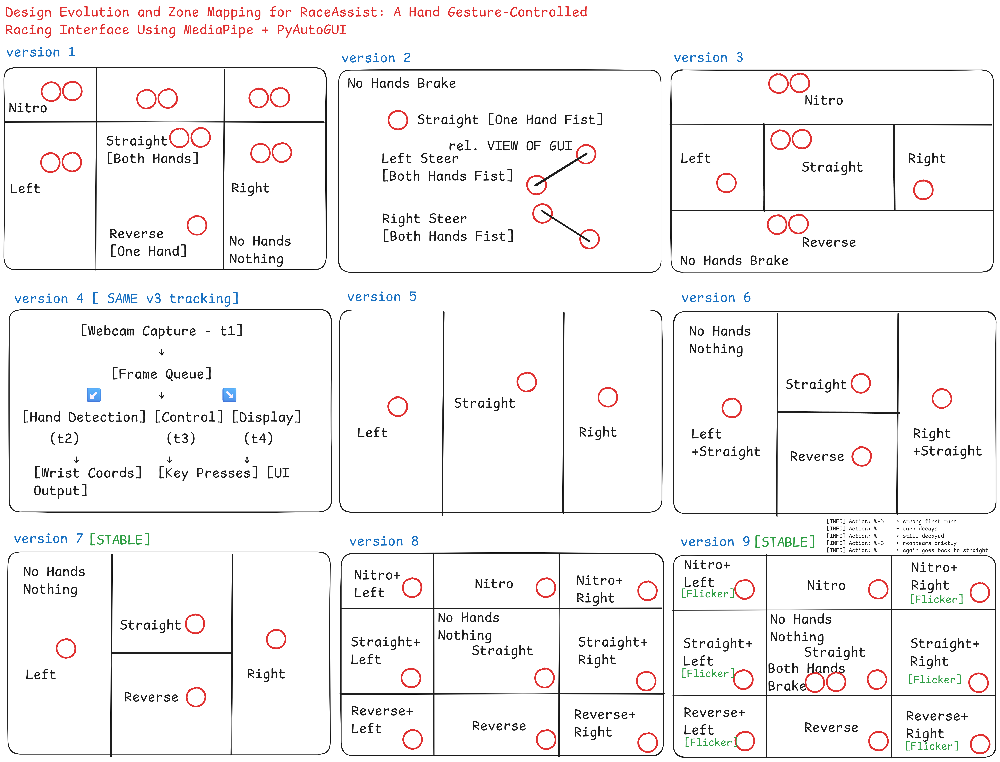

# 🏎️ **RaceAssist: Gesture-Based Racing Game Controller using MediaPipe + PyAutoGUI**

### 🔽 Download & Try Now
> 🎮 RaceAssist – Plug & Play Edition

[](https://github.com/kintsugidev/RaceAssist/releases/download/v1.0/RaceAssist.exe)


## 🔧 Overview

**RaceAssist** is an innovative, vision-based steering system that allows users to control racing games using hand gestures > with **no physical controller or keyboard**. Built using **Python**, **MediaPipe**, and **PyAutoGUI**, this lightweight yet robust interface turns your webcam into a fully functional racing game controller.

The system supports **multiple control schemes** across **9 evolving versions**, each exploring a unique interaction paradigm > from basic wrist tracking and gesture recognition to multi-key zones, flicker-resistant logic, and parallel processing pipelines.

Whether you're a gamer, developer, or HCI researcher, **RaceAssist** offers a smooth, intuitive, and extensible gesture-based experience for both simulation and real-time control.

---

## 📦 What's Included?

| Component               | Description                                               |
| ----------------------- | --------------------------------------------------------- |
| `RaceAssist.exe`        | ✅ Plug-and-play Windows executable (no setup needed)      |
| `run.py` (v1–v9)        | 🔧 All Python versions with modular logic                 |
| `requirements.txt`      | 📦 All required Python packages (MediaPipe, OpenCV, etc.) |
| `RaceAssist.png`        | 🧠 Visual overview of gesture zones across versions       |
| `RaceAssist.excalidraw` | 📝 Editable diagram file (UI logic flow)                  |
| `README.md`             | 📘 This documentation                                     |

---

## 🚀 Quickstart (For Windows Users)

No Python required > just double-click:

```bash
./RaceAssist.exe
```

For developers or Linux/macOS users:

```bash
pip install -r requirements.txt
python v9_Stable/run.py
```

---

## 🎮 Control Versions at a Glance

| Version | Gesture System            | Key Highlights                          |
| ------- | ------------------------- | --------------------------------------- |
| v1      | Basic wrist zones         | Fast prototyping, Nitro zone            |
| v2      | Fist detection            | Gesture clarity with brake control      |
| v3      | Grid zones (top/bottom)   | Nitro + Reverse support                 |
| v4      | Multithreaded control     | Responsive, non-blocking FPS            |
| v5      | Single-hand zones         | Lightweight fallback                    |
| v6      | Smart multi-key (a+w/d+w) | Smooth directional motion               |
| v7 ✅    | Stable 2D grid            | Clean and stable for 1-hand use         |
| v8      | 3x3 control grid          | Full directional combos (e.g., shift+a) |
| v9 ✅    | Stable + Decay + Brake    | Best for realism and gameplay           |

---

## 🎯 Ideal For

* 🧪 **HCI Experiments**
* 🕹️ **Gesture-Based Game Mods**
* 🧠 **AI/ML + Computer Vision Learning**
* 🧪 **Human-Computer Interaction Prototypes**

---

## 👨‍💻 Developed At

Built with ❤️ by [Kintsugi Dev Studio](https://www.kintsugidev.studio) > combining computer vision, system design, and human-centered interaction.

## Design Evolution and Zone Mapping for RaceAssist: A Hand Gesture-Controlled Racing Interface Using MediaPipe + PyAutoGUI


---

# 🕹️ RaceAssist Steering Versions Comparison
---

## 🧠 v1 – **Zone-Based Wrist Steering**

### 🔧 Features

* Uses both wrist positions (if available)
* Screen divided into:

  * Left / Center / Right (for steering)
  * Top (Nitro)
* One hand = Reverse
* No hand = No key pressed
* Actions: `Left`, `Right`, `Straight`, `Reverse`, `Nitro`, `None`

### ✅ Pros

* Very intuitive zone-based layout
* Minimal computation (only wrist coordinates)
* Both hands together = clean intent detection

### ❌ Cons

* No gesture type (e.g., fist) recognition
* No reverse with both hands low
* No dynamic steering (discrete zones only)

---

## 🤜 v2 – **Fist Recognition-Based Steering**

### 🔧 Features

* Detects **fist gestures** using `index_tip - index_mcp` distance
* Actions determined based on:

  * Y-coordinates of 2 fists → Nitro, Left, Right
  * 1 fist → Straight
  * No fist → Brake
* Draws a line between 2 fists for feedback

### ✅ Pros

* Fist recognition adds gesture clarity
* Prevents accidental movement (must clench fists)
* Brake when hands are relaxed

### ❌ Cons

* Requires **accurate fist recognition**
* Sensitive to small hand variations
* Difficult for some users to clench both fists constantly

---

## 🧭 v3 – **Advanced Grid-Zone Wrist Control**

### 🔧 Features

* Zones:

  * Left & Right (for steering)
  * Top (Nitro)
  * Bottom (Reverse)
* Any hand in **bottom zone** = Reverse
* Any hand in left/right = Directional steer
* Both hands up = Nitro
* No hand = Brake

### ✅ Pros

* Flexible zone design
* Clear logic:

  * bottom = reverse
  * top = nitro
* Supports both 1 or 2 hand control
* Highly responsive

### ❌ Cons

* No gesture recognition (just wrist location)
* No fine control (zone only, no analog steering)
* Slightly more logic-heavy than v1


Here is a **Markdown (`.md`) summary** comparing **version 4**, **version 5**, and **version 6** of your `RaceAssist` gesture steering system, based on the second diagram and the corresponding code implementations.

---

## 🔄 v4 – **Parallel Processing with Threads**

### 🔧 Features

* 🧵 4 threads:

  * `capture_frames`: webcam feed
  * `detect_hands`: process landmarks
  * `control_action`: apply zone-based logic
  * `display_output`: draw interface
* Zones:

  * Top = Nitro
  * Bottom = Reverse
  * Left / Right / Center = Steering
* Key logic matches v3 but **split for performance**

### ✅ Pros

* Fast & responsive due to parallelism
* Non-blocking architecture; useful for higher FPS
* Clean separation of concerns

### ❌ Cons

* Requires thread-safe resource handling (`coords_lock`)
* Slightly higher memory & CPU usage
* Complex to debug compared to single-threaded versions

---

## 🧱 v5 – **Basic Single-Hand Zone Control**

### 🔧 Features

* One hand only
* 3 vertical zones:

  * Left = 'a'
  * Center = 'w'
  * Right = 'd'
* No gesture or vertical detection
* Uses wrist `x` position only

### ✅ Pros

* Extremely lightweight and minimal
* Easy to understand and extend
* Ideal for demos or fallback mode

### ❌ Cons

* No Nitro or Reverse
* No multi-hand or multi-key combos
* Not immersive for racing gameplay

---

## 🧭 v6 – **Smart Dual-Direction Control**

### 🔧 Features

* Combines horizontal and vertical wrist zones
* Zones:

  * Top Center = Forward (`w`)
  * Bottom Center = Reverse (`s`)
  * Left = `a + w` (Left+Forward)
  * Right = `d + w` (Right+Forward)
* Multi-key press logic using Python `set` operations

### ✅ Pros

* Smooth forward turning: `a + w`, `d + w`
* Natural vertical ↕ + horizontal ↔ division
* Works well with only **one hand**

### ❌ Cons

* No Nitro support
* Requires precise control around center split
* Could confuse users with two key outputs unless well trained


Here's a **complete structured `.md` comparison** of **RaceAssist versions 7–9**, focusing on their features, gesture zones, multi-key logic, flicker control, and UI grid precision > as seen in the diagram and verified by their code.

---

## 🧠 v7 – 2D Grid-Based Stable Steering

### 🔧 Features

* Simple **vertical (L/R)** and **horizontal (Straight/Reverse)** split
* 4 Zones:

  * Left → `a`
  * Right → `d`
  * Top Middle → `w`
  * Bottom Middle → `s`
* Only 1 key pressed at a time

### ✅ Pros

* **Very stable** for 1-hand use
* Minimal key flickering
* Easy to learn and use

### ❌ Cons

* No Nitro
* No multi-key turn+forward combinations
* No 2-hand brake detection

---

## 🧱 v8 – 3x3 Grid with Combined Controls

### 🔧 Features

* Full **3x3 zone grid**:

  * X: Left, Center, Right
  * Y: Top (Nitro), Center (Straight), Bottom (Reverse)
* Allows combinations like:

  * Top-Left → `shift + a`
  * Center-Left → `w + a`
  * Bottom-Right → `s + d`

### ✅ Pros

* **Powerful control**: supports all combinations
* More expressive zones for racing turns
* Nitro supported

### ❌ Cons

* **Flickering possible** when zone is unclear
* Slightly unstable in fast hand transitions
* No 2-hand brake support

---

## 🧭 v9 – Smart 3x3 with Turn Decay Logic

### 🔧 Features

* Same 3x3 layout as v8
* Adds:

  * ✅ **2-hand Brake Mode** → Presses `space`
  * ✅ **Flicker-resistant turn decay** using state machine

    * Only triggers new turns if cooldown passed
    * Prevents constant release-repress of `a`/`d`

### ✅ Pros

* ✅ Stable + responsive
* ✅ Realistic flick behavior (short burst then decays)
* ✅ Nitro, Reverse, and precise control supported
* ✅ Ideal for real racing simulation

### ❌ Cons

* Slightly more complex logic
* Hand must exit zones clearly to reset decay

---

## 🎯 Final Thoughts

* v1: is great for fast prototyping and simplicity.
* v2: adds gesture sophistication (fist control) but may struggle with detection.
* v3: provides the most robust and flexible control using vertical & horizontal zones, suitable for real gameplay.
* v4: Best for responsive gameplay, modular systems, or integration with game engines.
* v5: Best for quick testing, educational examples, and when you want barebones logic.
* v6: Best for simplified, immersive 1-hand steering games (like mobile or low-input games).
* v7: Demo for kids or beginners
* v8: Full steering + Nitro combo gameplay
* v9: Realistic game / Decay + Brake Support
