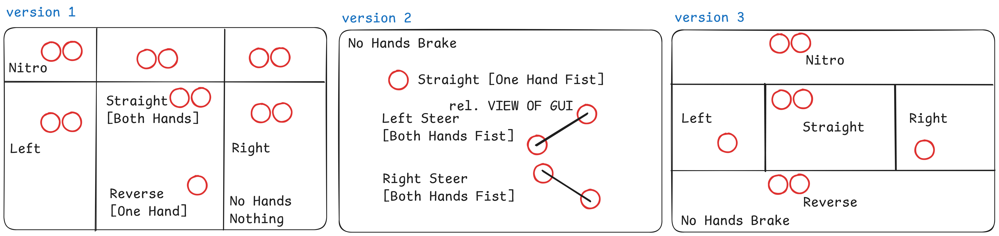
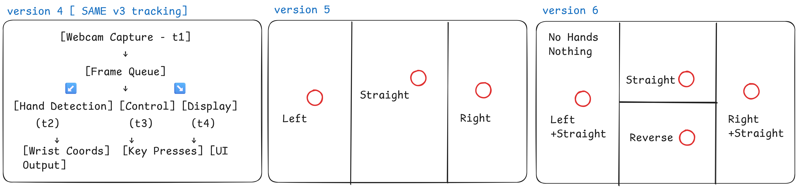
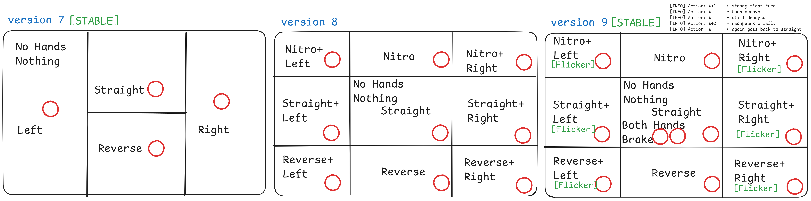

# 🏎️ **RaceAssist: Gesture-Based Racing Game Controller using MediaPipe + PyAutoGUI**

### 🔽 Download & Try Now
> 🎮 RaceAssist – Plug & Play Edition

[](https://github.com/kintsugidev/RaceAssist/releases/download/v1.0/RaceAssist.exe)

RaceAssist is provided "as is", without warranty of any kind, express or implied. 
The developer shall not be held responsible for any damage, malfunction, or misuse 
arising from the installation or use of this software.

## 🔧 Overview

**RaceAssist** is an innovative, vision-based steering system that allows users to control racing games using hand gestures > with **no physical controller or keyboard**. Built using **Python**, **MediaPipe**, and **PyAutoGUI**, this lightweight yet robust interface turns your webcam into a fully functional racing game controller.
> Design Evolution and Zone Mapping for RaceAssist: A Hand Gesture-Controlled Racing Interface Using MediaPipe + PyAutoGUI


The system supports **multiple control schemes** across **9 evolving versions**, each exploring a unique interaction paradigm > from basic wrist tracking and gesture recognition to multi-key zones, flicker-resistant logic, and parallel processing pipelines.

Designed to run on low-spec consumer hardware using only a standard webcam, RaceAssist offers an accessible, cost-effective alternative to traditional game controllers; eliminating the need for specialized sensors, GPUs, or proprietary equipment.

Whether you're a gamer, developer, or HCI researcher, **RaceAssist** offers a smooth, intuitive, and extensible gesture-based experience for both simulation and real-time control.

---

## 📦 What's Included?

| Component               | Description                                               |
| ----------------------- | --------------------------------------------------------- |
| `RaceAssist.exe`        | ✅ Plug-and-play Windows executable (no setup needed)      |
| `run.py` (v1–v9)        | 🔧 All Python versions with modular logic                 |
| `requirements.txt`      | 📦 All required Python packages (MediaPipe, OpenCV, etc.) |
| `RaceAssist.png`        | 🧠 Visual overview of gesture zones across versions       |
| `RaceAssist.excalidraw` | 📝 Editable diagram file (UI logic flow)                  |
| `README.md`             | 📘 This documentation                                     |

---

## 🚀 Quickstart (For Windows Users)

No Python required > just double-click:

```bash
./RaceAssist.exe
```

For developers or Linux/macOS users:

```bash
# Create a virtual environment
python -m venv venv

# Activate the environment
.\venv\Scripts\activate

# Install Libs
pip install -r requirements.txt
python v9_Stable/run.py
```

---

## 🎮 Control Versions at a Glance

| Version | Gesture System            | Key Highlights                          |
| ------- | ------------------------- | --------------------------------------- |
| v1      | Basic wrist zones         | Fast prototyping, Nitro zone            |
| v2      | Fist detection            | Gesture clarity with brake control      |
| v3      | Grid zones (top/bottom)   | Nitro + Reverse support                 |
| v4      | Multithreaded control     | Responsive, non-blocking FPS            |
| v5      | Single-hand zones         | Lightweight fallback                    |
| v6      | Smart multi-key (a+w/d+w) | Smooth directional motion               |
| v7 ✅    | Stable 2D grid            | Clean and stable for 1-hand use         |
| v8      | 3x3 control grid          | Full directional combos (e.g., shift+a) |
| v9 ✅    | Stable + Decay + Brake    | Best for realism and gameplay           |

---

## 🎯 Ideal For

* 🧪 **HCI Experiments**
* 🕹️ **Gesture-Based Game Mods**
* 🧠 **AI/ML + Computer Vision Learning**
* 🧪 **Human-Computer Interaction Prototypes**


---

## 🕹️ Research and Analysis on RaceAssist: A Vision-Based, Gesture-Driven Game Control System for Real-Time Steering Interfaces Using MediaPipe and PyAutoGUI


---

### 📄 **Abstract**

In an era increasingly driven by touchless interaction and immersive computing, **RaceAssist** explores an intuitive and low-cost alternative to traditional game controllers through real-time **gesture-based input systems**. This research investigates the development and evolution of *RaceAssist*, a modular, vision-powered interface enabling users to control racing games using only their hand gestures, captured through a standard webcam and interpreted using **MediaPipe** for landmark detection and **PyAutoGUI** for simulated keystrokes.

The project presents a comparative study of **nine evolving control models**, ranging from basic zone-based wrist detection to advanced multi-threaded pipelines and gesture-recognition-enhanced input. Key challenges such as gesture ambiguity, input flickering, and detection latency are systematically addressed through novel solutions including **turn decay logic**, **2-hand brake state inference**, and **parallel control architecture**.

The study evaluates each version across metrics of **usability, responsiveness, and cognitive load**, contributing insights into designing effective gesture-based HCI systems. The final version (v9) integrates a robust 3x3 control grid with intelligent input decay and flicker suppression, showing high promise for real-world applicability in both recreational gaming and experimental HCI setups.

This research aims to demonstrate how **accessible hardware and open-source CV tools** can be leveraged to create **fluid, natural, and expressive interfaces**, especially relevant for users in accessibility contexts, human-robot interaction prototypes, or low-cost simulation environments. Future work includes exploring **analog gesture mapping**, **AI-based gesture classification**, and **VR/XR integrations**, advancing toward adaptive, personalized gesture interaction systems.

---
## 🚧 Phase 1: Foundation & Prototyping

## 🧠 v1 – **Zone-Based Wrist Steering**

### 🔧 Features

* Uses both wrist positions (if available)
* Screen divided into:

  * Left / Center / Right (for steering)
  * Top (Nitro)
* One hand = Reverse
* No hand = No key pressed
* Actions: `Left`, `Right`, `Straight`, `Reverse`, `Nitro`, `None`

### ✅ Pros

* Very intuitive zone-based layout
* Minimal computation (only wrist coordinates)
* Both hands together = clean intent detection

### ❌ Cons

* Both hands position become more tiring
* No gesture type (e.g., fist) recognition
* No reverse with both hands low
* No dynamic steering (discrete zones only)

---

## 🤜 v2 – **Fist Recognition-Based Steering**

### 🔧 Features

* Detects **fist gestures** using `index_tip - index_mcp` distance
* Actions determined based on:

  * Y-coordinates of 2 fists → Nitro, Left, Right
  * 1 fist → Straight
  * No fist → Brake
* Draws a line between 2 fists for feedback

### ✅ Pros

* Fist recognition adds gesture clarity
* Prevents accidental movement (must clench fists)
* Brake when hands are relaxed

### ❌ Cons

* Requires **accurate fist recognition**
* Sensitive to small hand variations
* Difficult for some users to clench both fists constantly

---

## 🧭 v3 – **Advanced Grid-Zone Wrist Control**

### 🔧 Features

* Zones:

  * Left & Right (for steering)
  * Top (Nitro)
  * Bottom (Reverse)
* Any hand in **bottom zone** = Reverse
* Any hand in left/right = Directional steer
* Both hands up = Nitro
* No hand = Brake

### ✅ Pros

* Flexible zone design
* Clear logic:

  * bottom = reverse
  * top = nitro
* Supports both 1 or 2 hand control
* Highly responsive

### ❌ Cons

* No gesture recognition (just wrist location)
* No fine control (zone only, no analog steering)
* Slightly more logic-heavy than v1

---
## ⚙️ Phase 2: Systemization & Expansion

## 🔄 v4 – **Parallel Processing with Threads**

### 🔧 Features

* 🧵 4 threads:

  * `capture_frames`: webcam feed
  * `detect_hands`: process landmarks
  * `control_action`: apply zone-based logic
  * `display_output`: draw interface
* Zones:

  * Top = Nitro
  * Bottom = Reverse
  * Left / Right / Center = Steering
* Key logic matches v3 but **split for performance**

### ✅ Pros

* Fast & responsive due to parallelism
* Non-blocking architecture; useful for higher FPS
* Clean separation of concerns

### ❌ Cons

* Requires thread-safe resource handling (`coords_lock`)
* Slightly higher memory & CPU usage
* Complex to debug compared to single-threaded versions

---

## 🧱 v5 – **Basic Single-Hand Zone Control**

### 🔧 Features

* One hand only
* 3 vertical zones:

  * Left = 'a'
  * Center = 'w'
  * Right = 'd'
* No gesture or vertical detection
* Uses wrist `x` position only

### ✅ Pros

* Extremely lightweight and minimal
* Easy to understand and extend
* Ideal for demos or fallback mode

### ❌ Cons

* No Nitro or Reverse
* No multi-hand or multi-key combos
* Not immersive for racing gameplay

---

## 🧭 v6 – **Smart Dual-Direction Control**

### 🔧 Features

* Combines horizontal and vertical wrist zones
* Zones:

  * Top Center = Forward (`w`)
  * Bottom Center = Reverse (`s`)
  * Left = `a + w` (Left+Forward)
  * Right = `d + w` (Right+Forward)
* Multi-key press logic using Python `set` operations

### ✅ Pros

* Smooth forward turning: `a + w`, `d + w`
* Natural vertical ↕ + horizontal ↔ division
* Works well with only **one hand**

### ❌ Cons

* No Nitro support
* Requires precise control around center split
* Could confuse users with two key outputs unless well trained

---
## 🏁 Phase 3: Stability & Realism

## 🧠 v7 – 2D Grid-Based Stable Steering

### 🔧 Features

* Simple **vertical (L/R)** and **horizontal (Straight/Reverse)** split
* 4 Zones:

  * Left → `a`
  * Right → `d`
  * Top Middle → `w`
  * Bottom Middle → `s`
* Only 1 key pressed at a time

### ✅ Pros

* **Very stable** for 1-hand use
* Minimal key flickering
* Easy to learn and use

### ❌ Cons

* No Nitro
* No multi-key turn+forward combinations
* No 2-hand brake detection

---

## 🧱 v8 – 3x3 Grid with Combined Controls

### 🔧 Features

* Full **3x3 zone grid**:

  * X: Left, Center, Right
  * Y: Top (Nitro), Center (Straight), Bottom (Reverse)
* Allows combinations like:

  * Top-Left → `shift + a`
  * Center-Left → `w + a`
  * Bottom-Right → `s + d`

### ✅ Pros

* **Powerful control**: supports all combinations
* More expressive zones for racing turns
* Nitro supported

### ❌ Cons

* **Flickering possible** when zone is unclear
* Slightly unstable in fast hand transitions
* No 2-hand brake support

---

## 🧭 v9 – Smart 3x3 with Turn Decay Logic

### 🔧 Features

* Same 3x3 layout as v8
* Adds:

  * ✅ **2-hand Brake Mode** → Presses `space`
  * ✅ **Flicker-resistant turn decay** using state machine

    * Only triggers new turns if cooldown passed
    * Prevents constant release-repress of `a`/`d`

### ✅ Pros

* ✅ Stable + responsive
* ✅ Realistic flick behavior (short burst then decays)
* ✅ Nitro, Reverse, and precise control supported
* ✅ Ideal for real racing simulation
* ✅ Single-hand operation reduces strain, enabling longer and more comfortable gameplay sessions.

### ❌ Cons

* Slightly more complex logic
* Hand must exit zones clearly to reset decay

---

## 🎯 Final Thoughts

* v1: is great for fast prototyping and simplicity.
* v2: adds gesture sophistication (fist control) but may struggle with detection.
* v3: provides the most robust and flexible control using vertical & horizontal zones, suitable for real gameplay.
* v4: Best for responsive gameplay, modular systems, or integration with game engines.
* v5: Best for quick testing, educational examples, and when you want barebones logic.
* v6: Best for simplified, immersive 1-hand steering games (like mobile or low-input games).
* v7: Demo for kids or beginners
* v8: Full steering + Nitro combo gameplay
* v9: Realistic game / Decay + Brake Support

---

## 🧪 Challenges Faced & How They Were Addressed

### 🧩 1. **Single Process Consumes All Key Input**

> **Problem**: Regardless of how many keys were sent via `pyautogui`, only one key was effectively recognized at a time in terminal-based or focused game windows.

**Why it happens**:
Most terminal or native Windows processes buffer only one keystroke at a time. Also, `pyautogui` simulates key events sequentially in the same thread, which isn’t truly parallel.

**How I addressed it**:

* Introduced **simulated key-holding** (e.g., hold `w` + tap `a`) instead of toggling.
* Added **interleaved multi-press loops** in `v8` and cooldown decay logic in `v9` for more natural control.
* Future fix: implement **parallel input injection** via tools like **`pynput`, `autopy`, or native OS key injection APIs**.

---

### 🕒 2. **Detection Latency Even on High-End Laptops**

> **Problem**: Hand tracking and landmark processing (especially via MediaPipe) lagged even on high-performance systems.

**Root Cause**:

* Real-time webcam + landmark model inference on CPU is expensive.
* Frame drops occur due to **sequential logic** (acquire → process → act → display).

**How I addressed it**:

* In **v4**, introduced **multi-threading** (capture, detect, control, display) using Python `threading`.
* Reduced `max_num_hands` to 1 when possible to cut computation by \~40%.
* Future fix: use **GPU-based** inference via **MediaPipe with TensorFlow GPU**, or shift to **OpenVINO / ONNX**.

---

### 🌍 3. **Varying Environment Light & Backgrounds**

> **Problem**: Different lighting conditions affected detection accuracy and stability.

**Fixes Tried**:

* Placed detection thresholds like `min_detection_confidence=0.7`, `min_tracking_confidence=0.7`.
* Added **visual guidance lines** (zones, wrist dots) to help user adjust hand positions.
* Future fix: integrate **background-agnostic tracking models** or **depth sensors** (e.g., Intel RealSense).

---

### 🎛️ 4. **Directional Intensity Is Too Binary**

> **Problem**: Left/right turns are **quantized**, meaning you're either turning or you're not->there’s no in-between.

**Effect**: Sudden jumps can cause **flickering**, especially near zone boundaries.

**Fix**:

* In `v9`, introduced a **cooldown + decay mechanism** so rapid hand jitter doesn’t retrigger the same action.
* Future fix:

  * Introduce a **"steering stabilizer"**: use smoothing techniques like **moving average** or **Kalman filter** on `wrist.x`.
  * Convert position to analog signal → **gradual turning (e.g., a=light, aa=hard left)**.

---

### 🔁 5. **No Natural Recovery Mechanism (Left to Straight to Right)**

> **Problem**: Transitioning from left to center and then to right feels abrupt -> no counterbalancing inertia.

**Solution Concept**:

* Implement a **momentum model** where zone transition logic includes "direction recovery":

  ```text
  If coming from 'Left', don't trigger 'Right' unless passed through 'Center' for N frames.
  ```
* Future idea: use **virtual steering wheel state**, which smoothly rotates and settles back to center over time.

---


### 🔮 Future Prospects & Feature Pipeline

| Feature                                    | Description                                                                                                                                               |
| ------------------------------------------ | --------------------------------------------------------------------------------------------------------------------------------------------------------- |
| 🧪 **Building v10: Adaptive Decay Tuning** | Enhance v9's flicker handling by implementing **logarithmic decay** in steering flicker strength -> reducing overreaction while preserving responsiveness. |
| 🧠 **Steering Stabilizer**                 | Apply smoothing on hand positions to prevent jitter (Kalman or EMA).                                                                                      |
| ⌨️ **True Parallel Keypress Engine**       | Replace `pyautogui` with `pynput`, `autopy`, or C++ native DLL key injection for true multi-key support.                                                  |
| 🎮 **Analog Steering Intensity**           | Use `wrist.x` value to simulate analog turning strength (light turn vs. hard turn).                                                                       |
| 🕶️ **VR/XR Mode**                         | Integrate with OpenXR or Unity to use gestures in immersive racing environments.                                                                          |
| 🧩 **Modular Configurator**                | Add UI to let users define their own zones and gestures (drag-and-drop grid designer).                                                                    |
| 📊 **Telemetry + HUD**                     | Show real-time hand position, detected action, reaction time, and frame rate overlay.                                                                     |
| 🤖 **AI-based Gesture Model**              | Replace handcrafted rules with a model trained on gesture sequences (LSTM or Transformer).                                                                |
| 📱 **Mobile Camera Input**                 | Stream camera from phone to PC via Wi-Fi (e.g., IP Webcam) for more flexible control.                                                                     |

> We're actively looking for collaborators from the fields of computer vision, HCI, and game development to help shape the next phase. If you have ideas, improvements, or just enthusiasm for gesture-based interaction, we’d love to build with you!

---

## 👨‍💻 Developed At

Built with ❤️ by [Kintsugi Dev Studio](https://www.kintsugidev.studio) > combining computer vision, system design, and human-centered interaction.

## ⚠️ Disclaimer

This software ("RaceAssist") is provided for educational and experimental purposes only.

By using this application, you acknowledge and agree that:

- You are solely responsible for how you use the software.
- The developer (Siddhant Bali / KintsugiDev.Studio) shall not be held liable for:
  - Any damage to your computer system, hardware, or peripherals.
  - Any software crashes, key misfires, or unintended behavior during use.
  - Any consequences arising from using this tool in games or system interfaces.

⚠️ Use cautiously and **at your own risk**. Test in safe environments.  
Make sure no important applications are running in the background.
